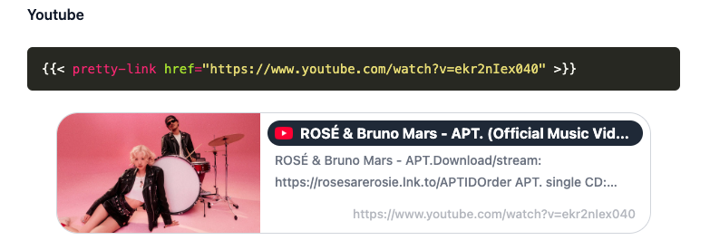

# Pretty Link



## Pretty Link Module

Add the following code to your module list in the `config/_default/module.toml` file.

```toml
[[imports]]
path = "github.com/craftgears/hugo-modules/pretty-link"
```

## Pretty Link Implementation

Add the following code to your `assets/scss/main.scss` file.

```css
@import 'pretty-link';
```

The href argument is the sole parameter for this shortcode.
Here's how to use it:

```html



```

- href
  - internal: Use a directory structure like `/posts/<path>`
  - external: Use a full URL like `https://example.org`