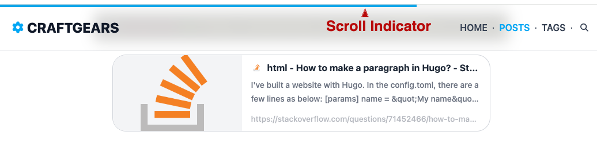

# Scroll Indicator



## Scroll Indicator Module

Add the following code to your module list in the `config/_default/module.toml` file.

```
[[imports]]
path = "github.com/craftgears/hugo-modules/scroll-indicator"
```

## Scroll Indicator Implementation

Add the following code to your `assets/scss/main.scss` file.

```css
@import 'scroll-indicator';
```

Add the following code to the top of `single.html`.

```html
  <!-- hugo-modules: scroll-indicator -->
  {{ partial "scroll-indicator.html" site.Params.scrollIndicator.color }}
```

Add the following settings to `config/_default/params.toml`.

```toml
# Scroll indicator
[scrollIndicator]
color = "#0ea5e9"
```

- color: Scroll position color